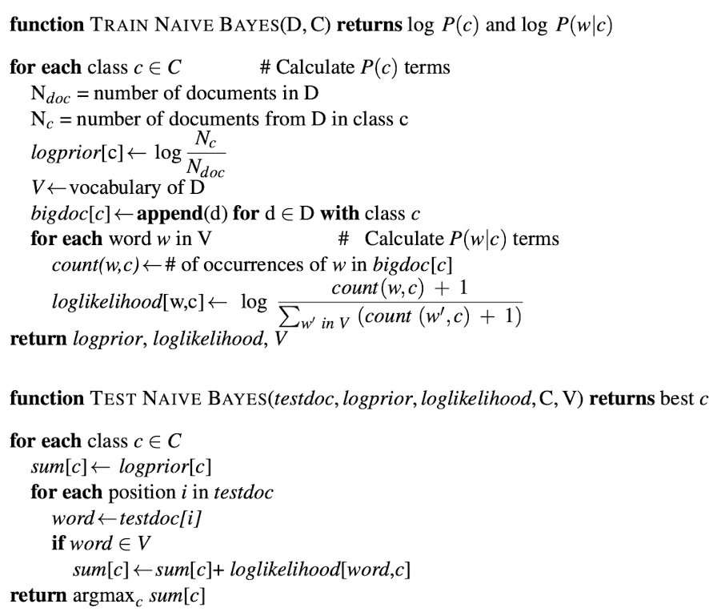
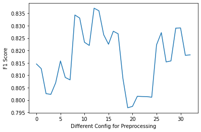
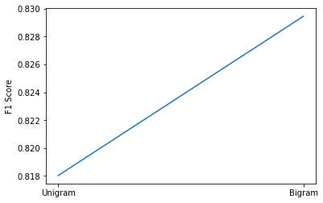
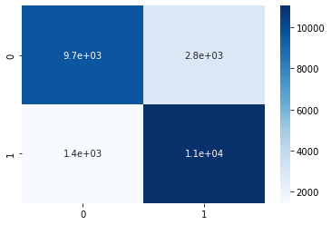
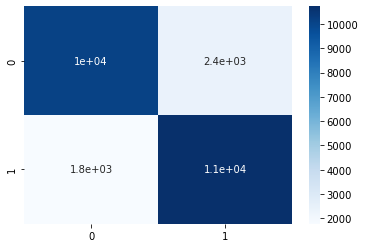

# Welcome to NB-Classifier

This documentation consists of the answers to the assignment question and the code used for the assignment CS-7417 (2022).

!!! note

    "Private Repository till grades are released" Due to academic integrity policies, all the information about the code & application can be found in the documentation and report submitted. The code is not available for public access in github.

# Code Walkthrough

The NB-Classifier python script is `Assign1.py` and you will need to update the `CONFIG`, `FILE_NAME` and `ENCODING` variables in the script if you want to use the script for your own purposes.

```python
ENCODING = "ISO-8859-1"
FILE_NAME = "NB-Classifier/imdb_master.csv"
CONFIG = {
    "stemming": True,
    "stop_words_removal": True,
    "contractions": False,
    "punctuation_removal": True,
    "lemmatization": False,
}
```

The python script can be run using the following command:

```bash
python3 Assign1.py > results.txt
```

The code is modularized into the following sections:

### text_normalization class:

With the `CONFIG` values given as a constant, the `text_normalization` class is used to preprocess the text based on the `CONFIG` values.
The techniques used are:

- Punctuation removal
- Stop words removal
- Stemming
- Lemmatization
- Contractions

Each of the above techniques is applied to the text and the dataframe is returned to `main` function.

### NaiveBayes class:

Textbook implementation of Naive Bayes Classifier, From [[1]](#references)



# Naive Bayes Classifier

A probabilistic classifier in which posterior probability $P(w|X)$ of a
new unknown entity can be formulated as, $$\label{pp} \tag{1.1}
    Posterior\;Probability = \frac{Probability\;of\;Likelihood \cdot Prior}{Prob.\;of\;Evidence}$$

## Training

For training and classifying the given data set, I have used
[[1]](#references) textbook algorithm to implement the Naive Bayes
Classifier, the number of documents is calculated from the trained data
set. Ndoc and then the classes are "Positive" and "Negative" i.e {0, 1}

For each class we calculate the

$$
logprior = \log \frac{ N_c }{ N_{doc} }
$$

From the given training data set

$$
N_c = \begin{cases}
            0: 12500 \\
            1: 12500
        \end{cases}, \; log\;prior = \begin{cases}
                                    0: -0.6931 \\
                                    1: -0.6931
                                  \end{cases}
$$

Further, we get to go through all the training data set to update our
vocabulary $V$, it will contain all the words from all classes C and
count the frequency of the word in each class in word_count. For
instance, the word count of "story" denoted as w_i in the
given data is,

$$
word\_counts[w_i] = \begin{cases}
                    0: 6673.0 \\
                    1: 5112.0
                \end{cases}
$$

To find the likelihood of the word, we find the total count of the word
present in each class c. In this step, we will find all the unique
words listed in the vocabulary V from the previous step. It can be
expressed as, $$\tag{1.2} \label{laplace}
    P(w_i | 0) = \log \frac{count(w_i, 0) + 1}{\sum_{w_i \in V}(count(w_i, 0) + 1)} = -5.761,  P(w_i | 1) \simeq -5.52$$
Calculating the likelihood of every word in the vocabulary V will be
training our model to predict a new word that comes into the
environment. Next, we will discuss how the test data works against our
model.

## Classification

With the train data, the model calculates the likelihood and prior of
each class. For the classification of whether a movie review is positive
or negative, we will provide the test data to find how well the model is
trained. Utilising the equation, we already have the values that are needed to classify.
Iterating through every single token, we will calculate the individual
word's positive and negative scores to determine the outcome class of
the given sentence.

## Helper Functions:

- `def splitData(data):`
  Splits the data into training and test data for the [NaiveBayes](#naivebayes-class) class.
- `def loadData(file_name, encoding):`
  Loads the data from the given file name and encoding.
- `def f1_score(pred, labels):`
  Calculates the F1 score for the given true and predicted values.

# Results

The f1 scores for given different configurations can be plot as a graph as shown below:



The results can be found in the `results.txt` file.

### Difference between UniGram vs BiGram



#### result.txt

```text
Time taken to process data:  166.6993911266327
Time taken for Model:  21.174
{'contractions': True,
 'lemmatization': False,
 'punctuation_removal': True,
 'stemming': True,
 'stop_words_removal': True}
 ==>  (9654, 2846, 1449, 11051)
 =>  0.8180316061517604
========================================
Time taken to process data:  166.439927816391
Time taken for Model:  48.785
{'contractions': True,
 'lemmatization': False,
 'punctuation_removal': True,
 'stemming': True,
 'stop_words_removal': True}
 ==>  (10111, 2389, 1769, 10731)
 =>  0.8294503691550452
```

#### Unigram Confusion Matrix



#### Bigram Confusion Matrix



Furthermore, we can use Lemmatization with POS Tagging techniques and
NB-SVM, an interesting approach to using the NB with SVM for text
classification can be investigated.

# References

[1] Dan Jurafsky and James H. Martin. <i>Speech and language processing
: an introduction to natural language processing, computational linguistics, and speech recognition.</i> Upper Saddle River, N.J.: Pearson
Prentice Hall, 2009. isbn: 9780131873216 0131873210. url: <a href="http://www.amazon.com/Speech-Language-Processing-2nd-Edition/dp/0131873210/ref=pd_bxgy_b_img_y.">http://www.amazon.com/Speech-Language-Processing-2nd-Edition/dp/0131873210/ref=pd_bxgy_b_img_y</a>
